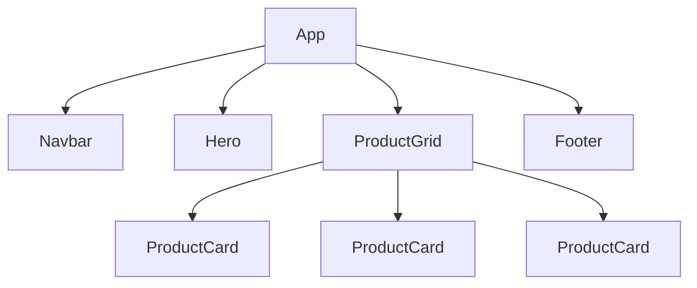

# Solution — Bài 0.6: Component Extraction

## Phần A — component_tree.md (Gợi ý)

### Sơ đồ cây Component

```
App
├── Navbar
│   ├── prop: logo (string)
│   └── prop: links (array of {label, href})
│
├── Hero
│   ├── prop: title (string)
│   ├── prop: subtitle (string)
│   └── prop: buttonText (string)
│
├── ProductGrid
│   ├── prop: title (string)
│   ├── prop: products (array of {id, name, price, image})
│   │
│   └── ProductCard (con)
│       ├── prop: image (string)
│       ├── prop: name (string)
│       └── prop: price (string)
│
└── Footer
    └── prop: text (string)
```

### Mermaid Diagram



### Lý do tách

| Component | Lý do tách |
|-----------|-----------|
| `Navbar` | Dùng ở mọi trang (home, about, products...). Thay đổi 1 lần → cập nhật mọi nơi |
| `Hero` | Section banner riêng, có thể thay title/subtitle cho từng trang |
| `ProductGrid` | Tách logic layout (grid) ra khỏi component con (card). Dễ thay đổi layout sau này |
| `ProductCard` | Lặp lại nhiều lần trong list. Sửa 1 component = sửa tất cả card |
| `Footer` | Dùng ở mọi trang, ít thay đổi |

---

## Phần B — shop_components.html (Solution)

```html
<!DOCTYPE html>
<html lang="vi">
<head>
    <meta charset="UTF-8">
    <title>ShopVN — Component Architecture</title>
    <script src="https://unpkg.com/react@18/umd/react.development.js" crossorigin></script>
    <script src="https://unpkg.com/react-dom@18/umd/react-dom.development.js" crossorigin></script>
    <script src="https://unpkg.com/@babel/standalone/babel.min.js"></script>
    <style>
        * { margin: 0; padding: 0; box-sizing: border-box; }
        body { font-family: Arial, sans-serif; }
        .navbar { background: #2c3e50; padding: 1rem 2rem; display: flex; justify-content: space-between; align-items: center; }
        .navbar .logo { color: #3498db; font-size: 1.5rem; font-weight: bold; text-decoration: none; }
        .navbar .nav-links { display: flex; gap: 1.5rem; }
        .navbar .nav-links a { color: white; text-decoration: none; }
        .hero { background: linear-gradient(135deg, #3498db, #2c3e50); color: white; text-align: center; padding: 4rem 2rem; }
        .hero h1 { font-size: 2.5rem; margin-bottom: 0.5rem; }
        .hero p { font-size: 1.2rem; margin-bottom: 1.5rem; opacity: 0.9; }
        .hero button { padding: 12px 30px; background: #e74c3c; color: white; border: none; border-radius: 25px; font-size: 1rem; cursor: pointer; }
        .products { padding: 2rem; max-width: 1000px; margin: 0 auto; }
        .products h2 { text-align: center; margin-bottom: 1.5rem; }
        .product-grid { display: grid; grid-template-columns: repeat(auto-fill, minmax(250px, 1fr)); gap: 1.5rem; }
        .product-card { border: 1px solid #ddd; border-radius: 12px; overflow: hidden; transition: transform 0.3s; }
        .product-card:hover { transform: translateY(-5px); box-shadow: 0 5px 20px rgba(0,0,0,0.1); }
        .product-card img { width: 100%; height: 200px; object-fit: cover; }
        .product-card .info { padding: 1rem; }
        .product-card h3 { margin-bottom: 0.3rem; }
        .product-card .price { color: #e74c3c; font-weight: bold; margin-bottom: 0.8rem; }
        .product-card button { width: 100%; padding: 8px; background: #3498db; color: white; border: none; border-radius: 6px; cursor: pointer; }
        footer { background: #2c3e50; color: white; text-align: center; padding: 1.5rem; margin-top: 2rem; }
        .empty-state { text-align: center; padding: 3rem; color: #999; }
    </style>
</head>
<body>
    <div id="root"></div>

    <script type="text/babel">
        // Component Navbar
        function Navbar({ logo, links }) {
            return (
                <nav className="navbar">
                    <a href="/" className="logo">{logo}</a>
                    <div className="nav-links">
                        {links.map((link, index) => (
                            <a key={index} href={link.href}>{link.label}</a>
                        ))}
                    </div>
                </nav>
            );
        }

        // Component Hero
        function Hero({ title, subtitle, buttonText }) {
            return (
                <section className="hero">
                    <h1>{title}</h1>
                    <p>{subtitle}</p>
                    <button>{buttonText}</button>
                </section>
            );
        }

        // Component ProductCard
        function ProductCard({ image, name, price }) {
            return (
                <div className="product-card">
                    
                    <div className="info">
                        <h3>{name}</h3>
                        <p className="price">{price}</p>
                        <button>Thêm vào giỏ</button>
                    </div>
                </div>
            );
        }

        // Component ProductGrid
        function ProductGrid({ products, title }) {
            return (
                <section className="products">
                    <h2>{title}</h2>
                    {products.length === 0 ? (
                        <p className="empty-state">Chưa có sản phẩm</p>
                    ) : (
                        <div className="product-grid">
                            {products.map(product => (
                                <ProductCard
                                    key={product.id}
                                    image={product.image}
                                    name={product.name}
                                    price={product.price}
                                />
                            ))}
                        </div>
                    )}
                </section>
            );
        }

        // Component Footer
        function Footer({ text }) {
            return (
                <footer>
                    <p>{text}</p>
                </footer>
            );
        }

        // Component App — chỉ compose, không logic chi tiết
        function App() {
            const navLinks = [
                { label: 'Giới thiệu', href: '#about' },
                { label: 'Sản phẩm', href: '#products' },
                { label: 'Liên hệ', href: '#contact' },
            ];

            const products = [
                { id: 1, name: 'Áo thun nam', price: '250.000đ', image: 'https://picsum.photos/300/200?random=1' },
                { id: 2, name: 'Quần jean nữ', price: '450.000đ', image: 'https://picsum.photos/300/200?random=2' },
                { id: 3, name: 'Giày sneaker', price: '890.000đ', image: 'https://picsum.photos/300/200?random=3' },
                { id: 4, name: 'Túi xách', price: '350.000đ', image: 'https://picsum.photos/300/200?random=4' },
            ];

            return (
                <div>
                    <Navbar logo="ShopVN" links={navLinks} />
                    <Hero
                        title="Chào mừng đến với ShopVN"
                        subtitle="Nơi mua sắm trực tuyến uy tín"
                        buttonText="Mua ngay"
                    />
                    <ProductGrid title="Sản phẩm nổi bật" products={products} />
                    <Footer text="© 2026 ShopVN. All rights reserved." />
                </div>
            );
        }

        const root = ReactDOM.createRoot(document.getElementById('root'));
        root.render(<App />);
    </script>
</body>
</html>
```

---

## Bài học rút ra

### Component Props Flow
```
App (data owner)
 │
 ├── Navbar ← links[] passed as prop
 │
 ├── Hero ← title, subtitle, buttonText as props
 │
 ├── ProductGrid ← products[] as prop
 │    └── ProductCard ← single product as props
 │         ↑
 │    .map() creates N instances
 │
 └── Footer ← text as prop
```

### Tại sao App "sạch" hơn?
- **App chỉ chứa data + compose**: Không có HTML render phức tạp
- **Mỗi component tự lo render của mình**: Navbar lo nav, ProductCard lo card
- **Dễ test**: Có thể test từng component riêng biệt
- **Dễ mở rộng**: Muốn thêm sản phẩm → thêm object vào mảng, không cần sửa JSX
